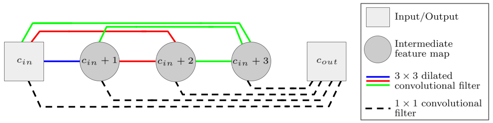
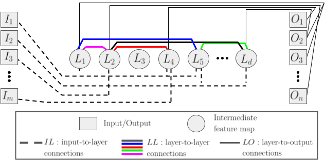
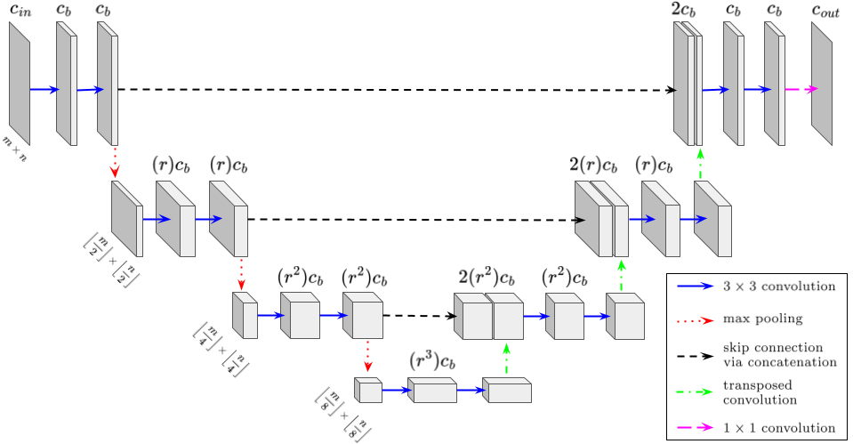

# Welcome to dlsia's documentation!

<a style="text-decoration:none !important;" href="https://dlsia.readthedocs.io/en/latest/" alt="website"></a>
<a style="text-decoration:none !important;" href="https://opensource.org/licenses/MIT" alt="License"></a>


dlsia (Deep Learning for Scientific Image Analysis) provides easy access to a number of segmentation and denoising
methods using convolution neural networks. The tools available are build for 
microscopy and synchrotron-imaging/scattering data in mind, but can be used 
elsewhere as well.

The easiest way to start playing with the code is to install dlsia and 
perform denoising/segmenting using custom neural networks in our tutorial 
notebooks located in the dlsia/tutorials folder, or perform multi-class 
segmentation in Gaussian noise
on [google colab](https://colab.research.google.com/drive/1ljMQ12UZ57FJjQ9CqG06PZo-bzOnY-UE?usp=sharing)

## Install dlsia

We offer several methods for installation. 

### pip: Python package installer

The latest stable release may be installed with:

```console
$ pip install dlsia .
```

### From source

dlsia may be directly downloaded and installed into your machine by 
cloning the public repository into an empty directory using:

```console
$ git clone https://github.com/phzwart/dlsia.git .
```

Once cloned, move to the newly minted dlsia directory and install 
dlsia using:

```console
$ cd dlsia
$ pip install -e .
```

### Further documentation & tutorial download

For more in-depth documentation and end-to-end training workflows, please 
visit our 
[readthedocs](https://dlsia.readthedocs.io/en/latest/index.html) page 
for more support. To download only the tutorials in a new folder, use the 
following terminal input for a sparse git checkout:

```console
mkdir dlsiaTutorials
cd dlsiaTutorials
git init
git config core.sparseCheckout true
git remote add -f origin https://github.com/phzwart/dlsia.git
echo "dlsia/tutorials/*" > .git/info/sparse-checkout
git checkout main
```

## Getting started

We start with some basic imports - we import a network and some training 
scripts:

```python
from dlsia.core.networks import msdnet
from dlsia.core import train_scripts
```

### Mixed-Scale dense networks (MSDNet)




A plain 2d mixed-scale dense network is constructed as follows:

```python
from torch import nn
msdnet_model = msdnet.MixedScaleDenseNetwork(in_channels=1,
                                             out_channels=1,
                                             num_layers=20,
                                             max_dilation=10)
```

while 3d network types for volumetric images can be built passing in equivalent 
kernels for 3 dimensions:

```python
from torch import nn
msdnet3d_model = msdnet.MixedScaleDenseNetwork(in_channels=1,
                                               out_channels=1,
                                               num_layers=20,
                                               max_dilation=10,
                                               normalization=nn.BatchNorm3d,
                                               convolution=nn.Conv3d)
```

Note that each instance of a convolution operator is followed by ReLU 
activation and batch normalization. To turn these off, simply pass in the 
parameters

```python
activation=None,
normalization=None
```

### Sparse mixed-scale dense network (SMSNet)




The dlsia suite also provides ways and means to build random, sparse mixed 
scale networks. SMSNets contain more sparsely connected nodes than a standard 
MSDNet and are useful to alleviate overfitting and multi-network aggregation. 
Controlling sparsity is possible, see full documentation for more details.

```python
from dlsia.core.networks import smsnet

smsnet_model = smsnet.random_SMS_network(in_channels=1,
                                         out_channels=1,
                                         layers=20,
                                         dilation_choices=[1, 2, 4, 8],
                                         hidden_out_channels=[1, 2, 3])
```
### Tunable U-Nets



An alternative network choice is to construct a UNet. Classic U-Nets can easily 
explode in the number of parameters it requires; here we make it a bit easier 
to tune desired architecture-governing parameters:

```python
from dlsia.core.networks import tunet

tunet_model = tunet.TUNet(image_shape=(121, 189),
                          in_channels=1,
                          out_channels=4,
                          base_channels=4,
                          depth=3,
                          growth_rate=1.5)
```

## Data preparation

To prep data for training, we make liberal use of PyTorch DataLoader 
classes. This allows for easy handling of data in the training process and 
automates the iterative loading of batch sizes.

In the example below, we take two numpy arrays consisting of training 
images and masks, pair and convert them into PyTorch tensors, then initialize 
the DataLoader class:

```python
from torch.utils.data import TensorDataset, DataLoader

train_data = TensorDataset(torch.Tensor(training_imgs), 
                           torch.Tensor(training_masks))

train_loader_params = {'batch_size': 20,
                       'shuffle': True}

train_loader = DataLoader(train_data, **train_loader_params)
```

## Training

Once your DataLoaders are constructed, the training of these networks is as 
simple as defining a torch.nn optimizer, and calling the training script:

```python
from torch import optim, nn
from dlsia.core import helpers
from dlsia.core import helpers

criterion = nn.CrossEntropyLoss()   # For segmenting
optimizer = optim.Adam(tunet_model.parameters(), lr=1e-2)

device = helpers.get_device()
tunet_model = tunet_model.to(device)

tunet_model, results = tunet_model.train_segmentation(net=tunet_model,
                                                      trainloader=train_loader,
                                                      validationloader=test_loader,
                                                      NUM_EPOCHS=epochs,
                                                      criterion=criterion,
                                                      optimizer=optimizer,
                                                      device=device,
                                                      show=1)
```

The output of the training scripts is the trained network and a dictionary with 
training losses and evaluationmetrics. You can view them as follows:

```python
   from dlsia.viz_tools import plots
   fig = plots.plot_training_results_segmentation(results)
   fig.show()
```

## Saving and loading models

Once a model is trained, PyTorch offers two methods for saving and loading 
models for inference. We walk through these options using the TUNet class
above.

### Saving model weights (recommended)

For the most flexibility in restoring models for later use, we save the model's
learned weights and biases with to a specific path with:

```python
torch.save(modelTUNet.state_dict(), PATH) .
```

A new TUNet model is then instantiated with the same architecture-governing 
parameters (image_shape, in_channels,etc.) and the learned weights are mapped 
back to the freshly-created model with:

```python
newTUNet = TUNet.TUNet(*args)
newTUNet.load_state_dict(torch.load(PATH)) .
```

### Saving the entire model

Alternatively, the entire model may be saved (pickled) using

```python
torch.save(modelTUNet, PATH)
```

and loaded with

```python
newTUNet = torch.load(PATH) .
```

Though more intuitive, this method is more prone to breaking, especially when 
modifying or truncating layers.


## License and Legal Stuff

This software has been developed from funds that originate from the US tax 
payer and is free for academics. Please have a look at the license agreement 
for more details. Commercial usage will require some extra steps. Please 
contact ipo@lbl.gov for more details.

## Final Thoughts

This documentation is far from complete, but have some notebooks as part of the codebase, which could provide a good
entry point.

More to come!
