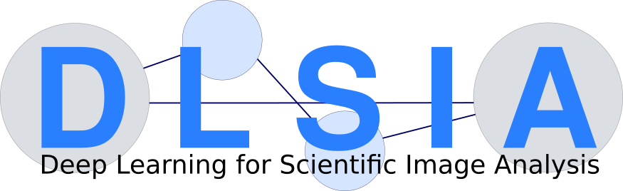

.. dlsia documentation file, created by Eric Roberts on Mon Jan 30th
   2023. You can adapt this file completely to your liking, but it should at
   least contain the root `toctree` directive.

dlsia documentation
===================

Welcome to the dlsia documentation, a collection of routines for machine
learning in scientific imaging. dlsia offers a friendly API for the easy
and flexible deployment of custom deep neural networks. At its core, dlsia
leverages `PyTorch <https://pytorch.org/>`_, an open source machine learning
framework maintained by the Linux Foundation.

The dlsia libraries were originally intended to provide a platform to test
the Mixed-Scale Dense Convolutional Neural Network architecture
(`MSDNet <https://doi.org/10.1073/pnas.1715832114>`_ with accompanying PyCUDA
`implementation <https://dmpelt.github.io/msdnet/index.html>`_) and extend its
usage to bioimaging and x-ray scattering applications.
MSDNets are a parameter-lean alternative to U-Nets that remain robust to
overfitting and have shown to provide a competitive performance over UNets,
particularly when training data is limited.

Over the past years, these libraries have grown into a collection of modules
for different interchangeable approaches. The dlsia libraries now contain,
apart from MSDNets, Tuneable U-Nets, Tuneable U-Net3+, and randomized Sparse
Mixed Scale networks (SMSNet). A uniform interface and a variety of utility
scripts for training provides one with convenient options to change network and
network architectures at will and find the one most suitable for your
application. In addition to routines for segmentation or denoising, our SMSNets
can be used in Autoencoders, image classification, and a variety of ensemble
methods. We provide tutorial notebooks for most of these use cases. The
development of dlsia is funded by a Laboratory Directed Research and
Development grant and by DOE-ASCR/BES funds.

.. toctree::
   :maxdepth: 2
   :caption: Getting Started:

   welcome.md

Tutorials
=========

.. toctree::
   :glob:
   :maxdepth: 1
   :caption: Basic dlsia Workflows

   tutorialLinks/segmentation_MSDNet_TUNet_TUNet3plus
   tutorialLinks/saving_loading_networks

.. toctree::
   :glob:
   :maxdepth: 1
   :caption: SMSNet Ensemble Learning

   tutorialLinks/ensembleLearning_SMSNets

.. toctree::
   :glob:
   :maxdepth: 1
   :caption: Image Denoising

   tutorialLinks/denoising_MSDNet_SMSNetEnsemble
   tutorialLinks/denoising_selfSupervised

.. toctree::
   :glob:
   :maxdepth: 1
   :caption: Image Classification

   tutorialLinks/imageClassification_SMSNetEnsemble
   tutorialLinks/imageClassification_SMSNetAutoencoderEnsemble

.. toctree::
   :glob:
   :maxdepth: 1
   :caption: Autoencoder Latent Space:

   tutorialLinks/latentSpaceExploration_SMSNetAutoencoders

Indices and tables
==================
* :ref:`genindex`
* :ref:`modindex`
* :ref:`search`

License and legal stuff
=======================

This software has been developed from funds that originate from the US tax
payer and is free for academics. Please have a look at the license agreement
for more details. Commercial usage will require some extra steps. Please
contact ipo@lbl.gov for more details.

Final thoughts
==============

This documentation is far from complete, but have some notebooks as part of the
codebase, which could provide a good entry point.

More to come!